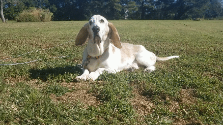

# Senior Dogs Daily

## Introduction

Senior Dogs Daily is a scheduled bot that selects a random adoptable senior dog from https://petfinder.com and posts it on X (https://x.com/seniordogsdaily).

## Why

Senior dogs fill me with joy. They remind me of my dog Lukas. I like seeing them in my social media feeds. Maybe others do too.

As an added upside, I hope it sparks an interest in senior dogs and encourages a positive perspective. They possess tremendous value but are sometimes overlooked for newer and shinier options. I want them to get love as well.

Lukas (2006-2020):



## Architecture

Senior Dogs Daily is hosted for free on Cloudflare Workers.

At 02:00 UTC (21:00 EST), 14:00 UTC (09:00 EST) 18:00 UTC (13:00 EST), and 22:00 UTC (17:00 EST) it will:

1. Get a list of adoptable senior dogs from Petfinder.
2. Loop over the list and select a dog that A) has photos and B) hasn't been posted before (previously posted dogs are stored in Cloudflare KV).
3. Get the dog's photos, process them as an `ArrayBuffer`, then convert them to a `base64` encoded string in preparation for X's API.
4. Upload the photos to X.
5. Post to X about the dog with the uploaded photos attached.

## Setup

Senior Dogs Daily is open source. While you're free to copy and run the code, I hope you use it as a guide to build your own unique bot instead of running a duplicate.

### Step 1 - Open a new text file

1. Open a new text file to temporarily hold API tokens and secrets as they're generated.

### Step 2 - Sign up/in at Petfinder

1. Sign up/in at https://petfinder.com/user/register.

### Step 3 - Get Petfinder API key & secret

1. Go to https://www.petfinder.com/developers and click **Get an API Key**.
2. From **Developer Settings**, https://petfinder.com/user/developer-settings, under **API Settings**, copy and paste the API key and secret to the temporary text file.

### Step 4 - Sign up/in at X

1. Sign up/in at https://twitter.com/i/flow/signup.
2. While signed in with the account above, sign up for a developer account at https://developer.twitter.com/en/portal/products/basic.

### Step 5 - Set X app permissions

1. From the **Developer Portal**, https://developer.twitter.com/en/portal/dashboard, click the **gear icon** to view your app's settings.
2. Under **User authentication settings**, click **Edit**.
3. Under **App permissions**, select **Read and write**.
4. Under **Type of App**, select **Web App, Automated App or Bot**.
5. Under **App info**:
   1. In the **Callback URI / Redirect URL** field, enter https://example.com.
   2. In the **Website URL** field, enter https://example.com.
6. Click **Save**.

\* For this bot, it doesn't matter what URL you enter because there's no callback or redirection taking place. However, X's requires this in order to post.

### Step 6 - Get X keys & tokens

1. From the **Developer Portal**, https://developer.twitter.com/en/portal/dashboard, click the **key icon** to view your app's keys and tokens.
2. Under **Authentication Tokens** and next to **Access Token and Secret**, click **Regenerate**.
3. Copy and paste the access token and secret to the temporary text file.
4. Under **Consumer Keys**, next to **API Key and Secret**, click **Regenerate**.
5. Copy the API key and secret to a temporary text file.

\* I couldn't get X to authenticate API requests on my first try. I'm not sure if it was of my own doing or internal to X. That said, I deleted the app X automatically generated then redid the permissions and keys and tokens steps. After that it worked. Try that if you have trouble with authentication.

### Step 7 - Sign up/in at Cloudflare

1. Sign up/in at https://www.cloudflare.com.

### Step 8 - Get Cloudflare Account ID

1. From the **Dashboard**, you'll see a string of random characters attached to the URL (e.g. https://dash.cloudflare.com/abcdefghijk...). The string, _abcdefghijk..._, is your Cloudflare Account ID. Copy and paste it to the temporary text file.

### Step 9 - Create Cloudflare API token

1. From the **Dashboard**, open the top-right drop down and click **My Profile** > **API Tokens**.
2. From **User API Tokens**, click **Create Token**.
3. Under **API token templates**, next to **Edit Cloudflare Workers**, click **Use template**.
4. Under **Permissions**, remove **Workers Routes** and **Cloudflare Pages**. **Workers R2 Storage** can be removed too, but you might want it in the future. It's up to you. Leave everything else.
5. Under **Account Resources**, next to **Include**, click the appropriate account (probably the account you're signed in as).
6. Click **Continue to Summary**.
7. Click **Create Token**.
8. Copy and paste the API token to a temporary text file.

### Step 10 - Setup Cloudflare KV

1. In the top right, click the arrow (**<-**) next to **My Profile** to go back to the Cloudflare **Dashboard**.
2. If you don't have any Workers in your account (skip if you do), in the left sidebar, click **Workers & Pages** > **Overview**. Under **Get started with Workers & Pages**, click **Create Worker** -- the Worker name and code isn't important -- then click **Deploy**. This is required because the Cloudflare UI won't let you create a KV namespace until the account has at least one worker.
3. In the left sidebar, click **Workers & Pages** > **KV**.
4. From **KV**, click **Create a namespace**.
5. Under **Create a namespace**, in the **Namespace** field, enter _SeniorDogsDaily-Bots-SocialMediaPoster-PostedDogs_.
6. Click **Add**.
7. In the table at the bottom, copy and paste the _ID_ next to _SeniorDogsDaily-Bots-SocialMediaPoster-PostedDogs_ to the temporary text file.

### Step 11 - Sign up/in at Github.

1. Sign up/in at https://github.com.

### Step 12 - Create Github repository

1. From the **Dashboard**, click **New**, fill in the fields, then click **Create repository**.

### Step 13 - Create GitHub repository secrets

1. From the new repository, click the **Settings** tab.
2. In the left menu, under **Security**, click **Secrets and variables** > **Actions**.
3. From **Actions secrets and variables**:
   1. Under **Repository secrets**, click **New repository secret**.
   2. From **Actions secrets / New secret**, in the **Secret field**, copy and paste the Cloudflare account ID from the temporary text file, name it _CLOUDFLARE_ACCOUNT_ID_, then click **Add secret**.
   3. Do the same for the Cloudflare API token. Name it _CLOUDFLARE_API_TOKEN_.

### Step 14 - Setup local directory

1. Create a local directory to store the code:

```
mkdir /path/to/senior-dogs-daily
```

2. Move to the created local directory:

```
cd /path/to/senior-dogs-daily
```

### Step 15 - Clone repository

1. Run the `git clone` command to clone the repository to your machine:

**SSH**

```
git clone git@github.com:shaneuuid/senior-dogs-daily.git
```

or **HTTPS** (enter GitHub credentials if prompted)

```
git clone https://github.com/shaneuuid/senior-dogs-daily.git
```

### Step 16 - Install NPM dependencies

1. Run the `npm install` command to install the repository's dependencies.

### Step 17 - Change repository remote URL

1. Run the `git remote` command to change the repository's remote URL:

```
git remote set-url origin https://github.com/your-username/your-repository.git
```

### Step 18 - Update Cloudflare KV ID

1. Open `wrangler.toml`.
2. Copy and paste the Cloudflare KV ID from the temporary text file (replacing the current ID):

```toml
# KV
kv_namespaces = [
  { binding = "KV_BOTS_SOCIAL_MEDIA_POSTER_POSTED_DOGS", id = "PASTE ID HERE" }
]
```

### Step 19 - Push to Github

1. Run the `git push` command to push the code to GitHub.

```
git push origin main
```

### Step 20 - Verify GitHub Action deployment & add Cloudflare secrets

1. From the Github, repository, click the **Actions** tab. You should see a green checkmark next to the workflow run.
2. From the Cloudflare **Dashboard**, in the left sidebar, click **Workers & Pages** > **Overview** (or refresh the page if you're still there). Under **Overiew**, you should see a _senior-dogs-daily_ Worker.
3. Click the Worker link, click the **Settings** tab, click **Variables**, then under **Environment Variables**, click **Add variable**.
4. Under **Edit Environment Variables**, in the **Variable name** and **Value** fields, copy and paste the corresponding values for each of the following variables from the temporary text file, making sure to click **Encrypt** as you progress:
   - _PETFINDER_CLIENT_ID_
   - _PETFINDER_CLIENT_SECRET_
   - _X_ACCESS_TOKEN_
   - _X_ACCESS_TOKEN_SECRET_
   - _X_API_KEY_
   - _X_API_SECRET_
5. Click **Save and deploy**.

\* The Worker name can be changed by updating the **name** value in `wrangler.toml`.

### Step 21 - Setup local development

1. Create a file named `.dev.vars`.
2. Copy and paste the environment variables and values from above into `.dev.vars`.

```.env
PETFINDER_CLIENT_ID=EXAMPLE
PETFINDER_CLIENT_SECRET=EXAMPLE
X_ACCESS_TOKEN=EXAMPLE
X_ACCESS_TOKEN_SECRET=EXAMPLE
X_API_KEY=EXAMPLE
X_API_SECRET=EXAMPLE
```

3. Run the `wrangler dev` command via `npm` to start the local development environment:

```
npm run dev -- --test-scheduled
```

4. Visit http://localhost:8787/\_\_scheduled to trigger the bot.
